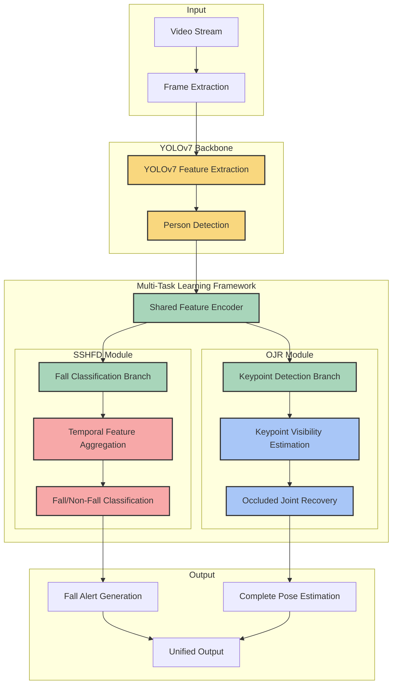

# YOLOv7-based Fall Detection System with Integrated SSHFD-OJR

This project implements a fall detection system using YOLOv7, with an integrated SSHFD-OJR (Single Shot Human Fall Detection with Occluded Joints Recovery) approach to detect falls and recover occluded keypoints in smart home applications.

## Overview

The fall detection system operates with a unified approach that combines two key capabilities:

1. **Fall Detection (SSHFD)**: Detects falling behavior quickly after detecting people
2. **Occluded Joints Recovery (OJR)**: Simultaneously predicts and recovers joint points when they are obscured by objects or other people

Unlike traditional approaches that treat these as separate components, our system integrates them into a single unified model. The system first uses YOLOv7 to detect people in frames, then simultaneously estimates keypoints and recovers any occluded joints using a multi-task learning framework. This integrated approach improves efficiency, reduces computational overhead, and enhances the system's ability to detect falls even in challenging occlusion scenarios.

### System Architecture



## Methodology Flow

The development of this integrated fall detection solution follows these key steps:

1. **Problem Definition**: 
   - Identify the challenges in fall detection with occlusions in smart home environments
   - Define requirements for a unified system that can simultaneously detect falls and recover occluded joints

2. **Data Collection and Preparation**:
   - Gather datasets containing fall and non-fall sequences with various occlusion scenarios
   - Preprocess and annotate data for multi-task learning
   - Implement data augmentation techniques to improve model robustness to occlusions
   - **Ensure dataset balance between fall and non-fall examples** to prevent biased training

3. **Unified Model Architecture Design**:
   - Integrate YOLOv7 as the backbone for accurate human detection
   - Design a multi-task learning framework that shares features between fall detection and joint recovery tasks
   - Implement task-specific branches with appropriate loss functions for each task
   - Create attention mechanisms to focus on potentially occluded regions

4. **End-to-End Training Process**:
   - Develop a balanced loss function that addresses both fall detection and joint recovery objectives
   - Implement a curriculum learning strategy that gradually increases the difficulty of occlusion scenarios
   - Train the unified model end-to-end to optimize both tasks simultaneously
   - **Monitor training metrics to ensure the model is learning to distinguish between classes**

5. **Evaluation and Optimization**:
   - Evaluate system performance on test datasets with various occlusion levels
   - Analyze failure cases and optimize model parameters for both tasks
   - Implement real-time processing optimizations for edge deployment

6. **Deployment**:
   - Package the unified solution for easy deployment in smart home environments
   - Implement an efficient inference pipeline for video and camera inputs

This unified methodology ensures a comprehensive and efficient approach to the fall detection problem, addressing the challenges of occlusion without the computational overhead of separate models.

## Project Structure

```
yolov7-fall-ssfhd-ojr-detection/
├── config/
│   └── config.yaml           # Configuration parameters for training and inference
├── custom_datasets/
│   ├── data_tuple3.csv       # Timestamps for fall and non-fall segments
│   └── chute*/               # Organized data by chute number
├── data/
│   ├── Fall/                 # Fall video segments organized by chute
│   ├── NoFall/               # Non-fall video segments organized by chute
│   ├── train_mp4/            # Training videos in MP4 format
│   ├── val_mp4/              # Validation videos in MP4 format
│   ├── test_mp4/             # Test videos in MP4 format
│   ├── train_mp4_nonfall/    # Non-fall training videos
│   ├── val_mp4_nonfall/      # Non-fall validation videos
│   ├── test_mp4_nonfall/     # Non-fall test videos
│   ├── train_list_mp4.txt    # Original training list with fall videos
│   ├── val_list_mp4.txt      # Original validation list with fall videos
│   ├── test_list_mp4.txt     # Original test list with fall videos
│   ├── train_list_balanced.txt # Balanced training list with fall and non-fall videos
│   ├── val_list_balanced.txt   # Balanced validation list with fall and non-fall videos
│   └── test_list_balanced.txt  # Balanced test list with fall and non-fall videos
├── models/
│   ├── yolov7/               # YOLOv7 implementation
│   ├── sshfd.py              # SSHFD model implementation
│   ├── ojr.py                # OJR model implementation
│   └── model_utils.py        # Shared utilities for models
├── utils/
│   ├── data_utils.py         # Dataset and dataloader utilities
│   ├── visual_utils.py       # Visualization tools
│   └── metrics.py            # Evaluation metrics
├── scripts/
│   ├── prepare_data.py       # Data preparation script
│   └── convert_dataset.py    # Script to convert datasets to project format
├── weights/
│   ├── yolov7.pt             # YOLOv7 pre-trained weights
│   ├── sshfd_state_dict.pt   # SSHFD model weights
│   └── ojr_state_dict.pt     # OJR model weights
├── logs/                     # Training logs organized by date and model type
├── outputs/                  # Inference outputs and visualizations
├── docs/                     # Documentation
├── train.py                  # Main training script
├── evaluate.py               # Evaluation script
├── detect_falls.py           # Fall detection inference script
├── create_simple_balanced_lists.py # Script to create balanced dataset lists
├── verify_videos.py          # Script to verify video integrity
├── debug_training.py         # Script to debug training issues
├── requirements.txt          # Project dependencies
└── README.md                 # Project information
```

## Installation

### Prerequisites

- Python 3.8+
- PyTorch 1.8+
- CUDA (recommended for faster training and inference)

### Setup

1. Clone the repository:
   ```bash
   git clone ...
   cd fall-detection-yolov7
   ```

2. Install dependencies:
   ```bash
   pip install -r requirements.txt
   ```

3. Download YOLOv7 weights and set up the project structure:
   ```bash
   python scripts/download_weights.py
   ```

## Dataset Preparation

The system supports several fall detection datasets:

- URFD (UR Fall Detection)
- Multi-Cam Fall Dataset
- UP-Fall Detection
- Le2i Fall Detection
- Custom datasets

### Complete Data Preparation Workflow

Follow these steps to properly prepare your data for training:

1. **Organize Raw Data**:
   ```bash
   python scripts/prepare_data.py --dataset urfd --raw-data /path/to/urfd --output-dir data
   ```
   This organizes your raw dataset into the project's expected structure.

2. **Create Balanced Dataset**:
   ```bash
   python create_simple_balanced_lists.py
   ```
   This script:
   - Analyzes your dataset structure
   - Identifies fall and non-fall segments based on annotations
   - Creates balanced training, validation, and test lists with both fall and non-fall examples
   - Outputs: `train_list_balanced.txt`, `val_list_balanced.txt`, and `test_list_balanced.txt`

3. **Filter Problematic Videos**:
   ```bash
   python filter_bad_videos.py
   ```
   This critical step:
   - Verifies each video in your balanced dataset
   - Identifies videos that cannot be properly loaded or have frame extraction issues
   - Creates filtered lists excluding problematic videos
   - Outputs: `train_list_balanced_filtered.txt`, `val_list_balanced_filtered.txt`, and `test_list_balanced_filtered.txt`
   - Also generates CSV files listing problematic videos for reference

4. **Update Configuration**:
   Update your `config.yaml` file to use the filtered lists:
   ```yaml
   data:
     train_list: data/train_list_balanced_filtered.txt
     val_list: data/val_list_balanced_filtered.txt
     test_list: data/test_list_balanced_filtered.txt
   ```

### Why These Steps Are Critical

- **Balanced Dataset**: Without proper class balance between fall and non-fall examples, your model may achieve high accuracy but zero precision/recall by simply predicting the majority class for all inputs.

- **Video Filtering**: Problematic videos that cannot be properly loaded will cause training errors or introduce dummy frames that negatively impact model performance.

- **Data Quality**: The quality of your training data directly affects model performance. Ensuring all videos can be properly loaded and processed is essential for effective training.

### Checking Dataset Statistics

After preparing your dataset, you can check the distribution of classes:

```bash
python scripts/dataset_stats.py
```

This will show:
- Number of fall vs. non-fall examples in each split
- Class distribution percentages
- Total number of frames
- Average video length

### Troubleshooting Data Issues

If you encounter issues with your dataset:

1. **Video Loading Problems**:
   - Check the video codec compatibility with OpenCV
   - Ensure GStreamer or FFMPEG is properly installed
   - Convert problematic videos to a more compatible format (e.g., MP4 with H.264 codec)

2. **Class Imbalance**:
   - If your dataset has significantly more examples of one class, use the `create_simple_balanced_lists.py` script to create a balanced dataset
   - Adjust the `fall_class_weight` parameter in `config.yaml` to give more weight to the minority class

3. **Frame Extraction Issues**:
   - Some videos may have corrupt frames or inconsistent frame rates
   - Use the `filter_bad_videos.py` script to identify and exclude these videos
   - Check the generated bad video lists to understand common issues

## Training

### Preparing for Training

Before starting the training process, ensure that:
1. You have prepared your dataset following the steps in the [Dataset Preparation](#complete-data-preparation-workflow) section
2. The configuration file (`config/config.yaml`) is set up with your desired parameters
3. The weights directory exists for saving model checkpoints

If you encounter checkpoint saving issues, run the fix script:
```bash
python fix_train.py
```

This script:
- Creates the necessary weights directory
- Fixes the checkpoint saving function
- Creates a wrapper script with additional error handling

### Training the SSHFD Model

To train the SSHFD (Single Shot Human Fall Detection) model:

```bash
# Option 1: Standard training script
python train.py --train-sshfd [--gpu GPU_ID]

# Option 2: Training with checkpoint fix (recommended)
python train_with_checkpoint_fix.py --train-sshfd [--gpu GPU_ID]
```

Parameters:
- `--train-sshfd`: Train the SSHFD model
- `--gpu`: GPU ID to use (use -1 for CPU)

The training process will:
1. Load the balanced and filtered dataset
2. Initialize the SSHFD model with the YOLOv7 backbone
3. Train for the specified number of epochs (set in `config.yaml`)
4. Save checkpoints when validation loss or F1 score improves
5. Output training and validation metrics after each epoch

### Training the OJR Model

To train the OJR (Occluded Joints Recovery) model:

```bash
python train.py --train-ojr [--gpu GPU_ID]
```

Parameters:
- `--train-ojr`: Train the OJR model
- `--gpu`: GPU ID to use (use -1 for CPU)

The OJR model training requires a pre-trained SSHFD model.

### Monitoring Training Progress

During training, the following metrics are reported for each epoch:
- Loss (total, keypoint, and fall components)
- Accuracy
- Precision
- Recall
- F1 Score
- AUC (Area Under the ROC Curve)

TensorBoard logs are saved to the `logs` directory and can be viewed with:
```bash
tensorboard --logdir=logs
```

### Training Troubleshooting

If you encounter issues during training, check for:

1. **Checkpoint Saving Errors**: 
   - If you see an error like `AttributeError: expected 'f' to be string, path, or a file-like object with a 'write' attribute`, run `python fix_train.py` to fix the issue
   - This creates the necessary weights directory and fixes the checkpoint saving function

2. **Class Imbalance**: 
   - Ensure your dataset has both fall and non-fall examples
   - If precision, recall, F1, and AUC are all zero while accuracy is high, your dataset likely has a class imbalance issue
   - Use `create_simple_balanced_lists.py` to create a balanced dataset

3. **Data Loading Errors**: 
   - Verify that all video files can be properly loaded with the `filter_bad_videos.py` script
   - This will identify and filter out problematic videos that cannot be properly loaded

4. **GPU Memory Issues**: 
   - Reduce batch size in `config/config.yaml` if encountering CUDA out of memory errors
   - Try using a smaller image size or reducing the model complexity

5. **Low Performance Metrics**:
   - If F1 score is low, try adjusting the `fall_class_weight` parameter in `config.yaml`
   - Experiment with different learning rates and training for more epochs
   - Consider using data augmentation to improve model generalization

## Evaluation

Evaluate the trained model:

```bash
python evaluate.py --config config/config.yaml --output-dir outputs/evaluation
```

## Inference

Run fall detection on a video:

```bash
python detect_falls.py --video path/to/video.mp4 --output outputs/output.mp4 --gpu -1
```

For GPU inference:

```bash
python detect_falls.py --video path/to/video.mp4 --output outputs/output.mp4 --gpu 0
```

## Debugging

If you encounter issues with the training process, you can use the debugging script:

```bash
python debug_training.py
```

To verify that all videos in your dataset can be loaded correctly:

```bash
python verify_videos.py
```

## Results

The unified SSHFD-OJR system achieves state-of-the-art performance on several fall detection benchmarks, particularly in scenarios with occlusions.

## Extensions

This implementation currently focuses specifically on fall detection with occlusion handling. While the system architecture could potentially be extended to detect other abnormal movements in the future, these are not implemented in the current version:

- Violent behavior
- Fainting/unconsciousness
- Unusual gait patterns
- Repetitive behaviors
- Unusual interactions with the environment

## Acknowledgements

- YOLOv7 by WongKinYiu (https://github.com/WongKinYiu/yolov7)
- Fall detection datasets: URFD, UP-Fall, Le2i, Multi-Cam